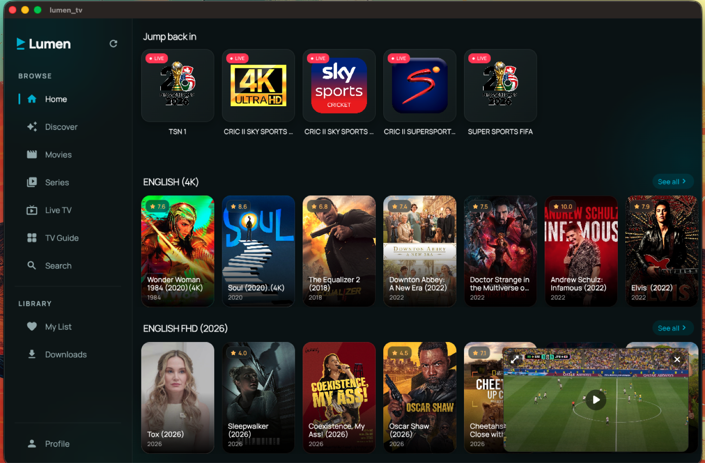
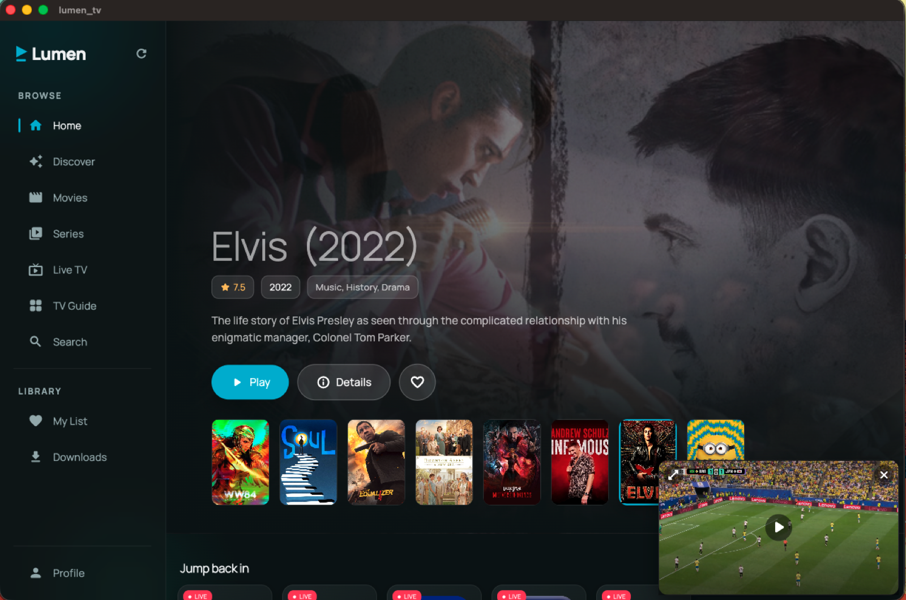
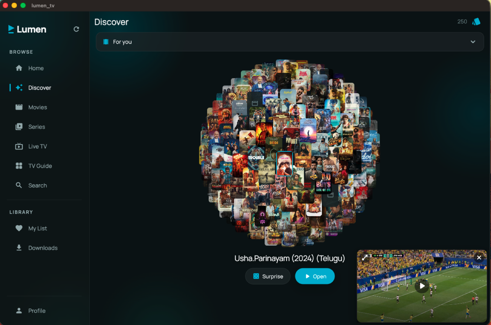
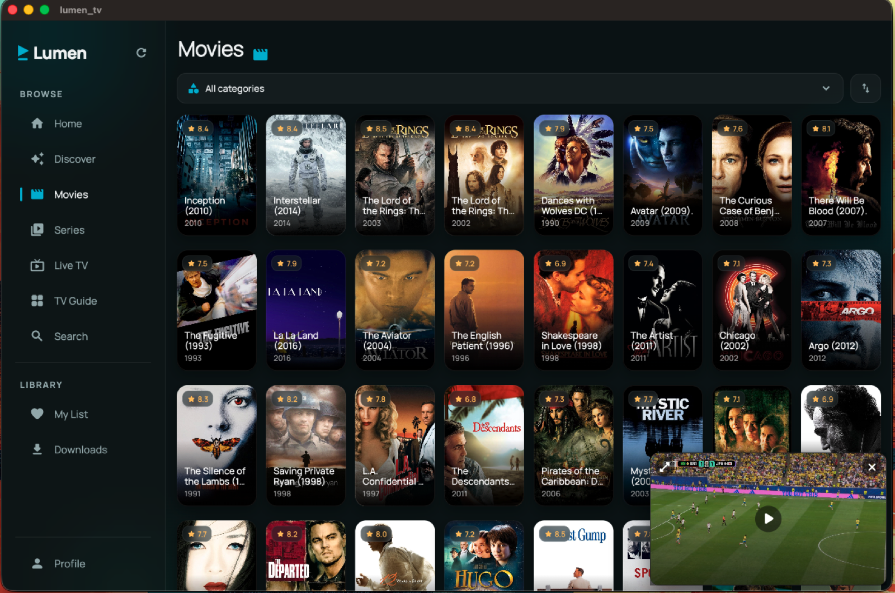
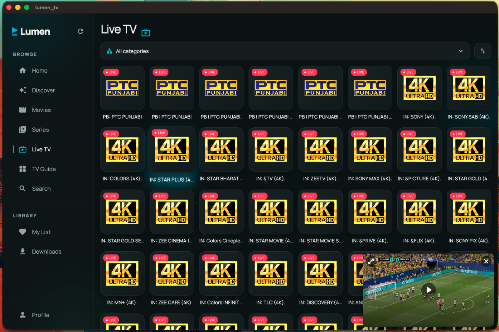

# Lumen

A native, premium **IPTV player** for your own Xtream / X3U subscription — Live TV, Movies and Series with a cinematic UI, on **iOS, Android, Android TV, macOS, Windows and Linux**.

> Bring your own provider. Lumen plays the IPTV service **you already pay for** — it ships with no channels or content of its own.

[](LICENSE)
[](CONTRIBUTING.md)

[](https://github.com/Talha-Ashraf420/Lumen-App/stargazers)

---

## ⬇️ Download (one click)

Grab the latest build for your platform — no login required:

[](https://github.com/Talha-Ashraf420/Lumen-App/releases/latest/download/Lumen-Windows.zip)
[](https://github.com/Talha-Ashraf420/Lumen-App/releases/latest/download/Lumen-macOS.zip)
[](https://github.com/Talha-Ashraf420/Lumen-App/releases/latest/download/Lumen-Linux-x64.tar.gz)
[](https://github.com/Talha-Ashraf420/Lumen-App/releases/latest/download/Lumen-Android.apk)
[-999999?style=for-the-badge&logo=apple&logoColor=white)](https://github.com/Talha-Ashraf420/Lumen-App/releases/latest/download/Lumen-iOS-unsigned.zip)

➡️ Or browse all builds on the **[Releases page](https://github.com/Talha-Ashraf420/Lumen-App/releases/latest)**.

| Platform | File | Install |
|----------|------|---------|
| **Windows** | `Lumen-Windows.zip` | Unzip → run `Lumen.exe` |
| **macOS** | `Lumen-macOS.zip` | Unzip → open `lumen_tv.app` *(right-click → Open the first time)* |
| **Linux** | `Lumen-Linux-x64.tar.gz` | Extract → run the `lumen_tv` binary |
| **Android / Android TV** | `Lumen-Android.apk` | Sideload, or `adb install Lumen-Android.apk` |
| **iOS** | `Lumen-iOS-unsigned.zip` | Unsigned — sideload with AltStore / Sideloadly |

> The download links resolve once the first CI run finishes publishing the **latest** release.

### 🔄 Auto-update on Android (recommended)

Install via **[Obtainium](https://github.com/ImranR98/Obtainium)** to get Lumen *and automatic updates* straight from GitHub Releases — no app store needed:

[](https://apps.obtainium.imranr98.dev/redirect.html?r=obtainium://add/https://github.com/Talha-Ashraf420/Lumen-App)

1. Install Obtainium, tap **Add App**.
2. Paste `https://github.com/Talha-Ashraf420/Lumen-App` → **Add**.
3. Obtainium installs it and notifies you whenever a new build is released.

> First sideloaded install on Android shows the system "install unknown apps" prompt once — that's normal. Lumen also has a built-in updater (Profile → Check for updates).

Looking to list Lumen on a store? See **[STORE_LISTING.md](STORE_LISTING.md)**.

---

## 📸 Screenshots

| Home | Movie detail | Discover |
|------|--------------|----------|
|  |  |  |

| Movies | Live TV |
|--------|---------|
|  |  |

---

## ✨ Features

- **Live TV** with EPG (now/next), catch-up, and a polished channel guide
- **Movies & Series** with TMDB-enriched art, ratings, cast and trailers
- **Immersive home** — full-bleed spotlight hero + scrollable shelves
- **My List**, Continue Watching, Recently watched, and watch stats
- **Discover globe**, search with sort/filter, multi-profile
- **Premium player** — A/V track & subtitle controls, subtitle styling & sync,
  speed, sleep timer, picture-in-picture mini-player, hold-for-2×
- **TV remote / D-pad** navigation on Android TV (focus highlights, direct transport)
- **Desktop-native** layout (sidebar, keyboard shortcuts, real fullscreen)

## 📺 Android TV

The APK is leanback-enabled and appears on the Android TV / Google TV home row.
Navigate with the remote: **D-pad** moves focus, **center/OK** opens & plays,
**◀ ▶** seek (or change channel on Live), **back** minimizes.

## 🛠️ Tech

Flutter • [media_kit](https://pub.dev/packages/media_kit) (libmpv) for native MKV/TS/HLS playback • Xtream Codes API • TMDB metadata.

## 🤖 Builds

Every push to `main` triggers [GitHub Actions](https://github.com/Talha-Ashraf420/Lumen-App/actions) which builds all six targets and publishes them to the **latest** release. You can also run the workflow manually from the **Actions** tab.

Build locally:

```bash
flutter pub get
flutter run                       # current device
flutter build apk --release       # Android
flutter build macos --release     # macOS
flutter build windows --release   # Windows (on Windows)
flutter build linux --release     # Linux
```

## 🤝 Contributing

Contributions are very welcome! Lumen is friendly to newcomers.

- Read **[CONTRIBUTING.md](CONTRIBUTING.md)** for setup, project layout and conventions.
- Pick up a [`good first issue`](https://github.com/Talha-Ashraf420/Lumen-App/labels/good%20first%20issue) or [`help wanted`](https://github.com/Talha-Ashraf420/Lumen-App/labels/help%20wanted).
- Have questions or ideas? Start a [Discussion](https://github.com/Talha-Ashraf420/Lumen-App/discussions).
- New here? The [architecture write-up](docs/blog/building-lumen.md) is a good primer.

### 🗺️ Roadmap / help wanted
- **Cast to TV** (Chromecast / DLNA) — the big open feature
- Localization / translations
- Background downloads on Android
- Windows & Linux polish, accessibility, more keyboard/remote shortcuts

If you're using Lumen, a ⭐ really helps others find it.

## 📄 License

[MIT](LICENSE) © Talha Ashraf. Lumen is a player only and includes no content; you are responsible for the sources you add.
