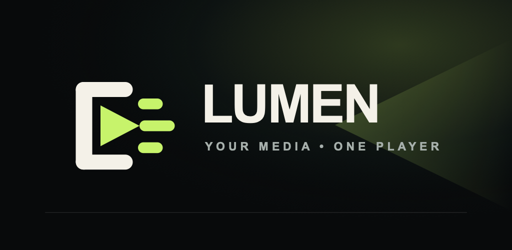
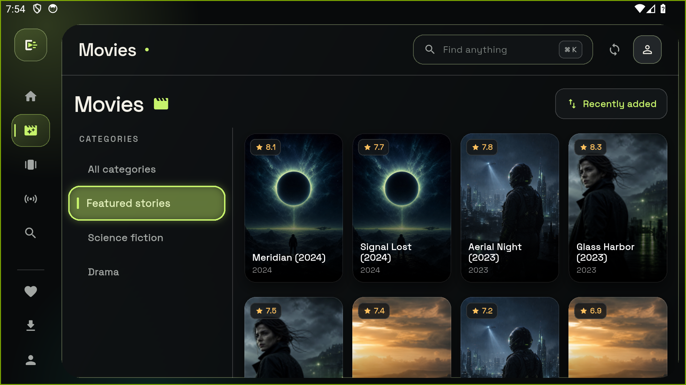
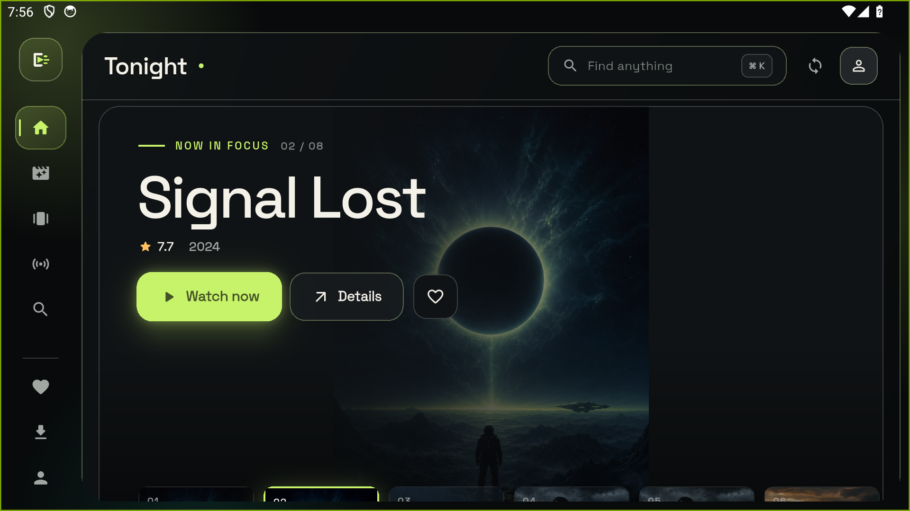
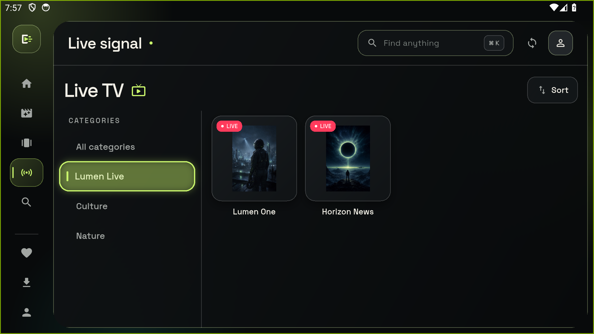
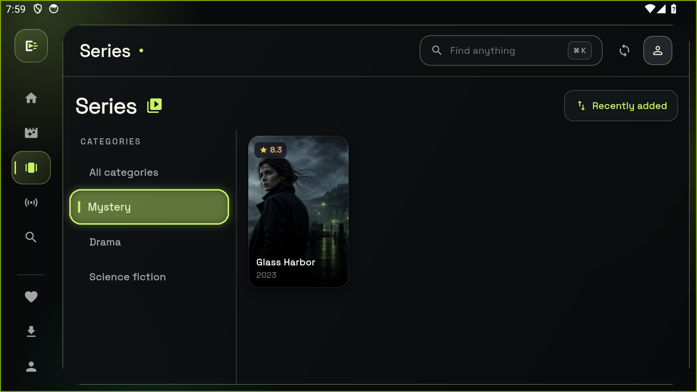
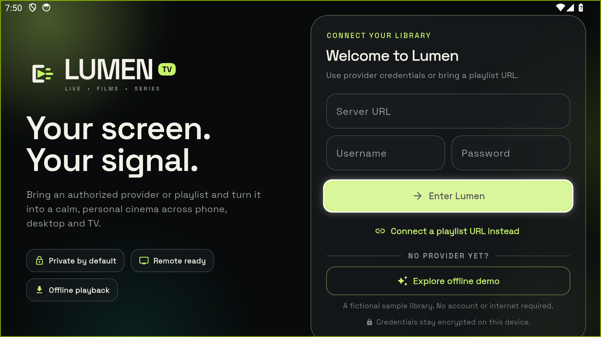

<p align="center">
  
</p>

<h1 align="center">Lumen</h1>

<p align="center">
  A cinematic, cross-platform IPTV player for the legal Xtream or M3U service you already use.
</p>

<p align="center">
  <a href="https://lumen-launch.vercel.app/"><strong>Website</strong></a> ·
  <a href="https://github.com/Talha-Ashraf420/Lumen-App/releases/latest"><strong>Downloads</strong></a> ·
  <a href="https://discord.gg/n8dfzrDNQg"><strong>Discord</strong></a> ·
  <a href="https://github.com/sponsors/Talha-Ashraf420"><strong>Sponsor</strong></a>
</p>

<p align="center">
  <a href="https://github.com/Talha-Ashraf420/Lumen-App/actions/workflows/build.yml"></a>
  <a href="https://github.com/Talha-Ashraf420/Lumen-App/releases/latest"></a>
  <a href="LICENSE"></a>
  <a href="CONTRIBUTING.md"></a>
  <a href="https://github.com/Talha-Ashraf420/Lumen-App/stargazers"></a>
</p>

> **Bring your own provider.** Lumen includes no channels, subscriptions or copyrighted media. It plays sources that users obtain legally.

## Why Lumen?

- **One polished library** for Live TV, movies and series
- **Built for the couch** with dependable Android TV remote and D-pad navigation
- **Continue anywhere** with favorites, watch history, multiple profiles and split-screen Live TV
- **Runs nearly everywhere** — Android, Android TV, iOS, macOS, Windows and Linux
- **Open and inspectable** — built in Flutter and released under the MIT license

---

## ⬇️ Get Lumen

Lumen has Google Play production access, but the first production release has
not been published yet. The Play listing is not currently a public download.
Follow the website or GitHub Releases for availability updates.

Discord testers can also install the signed **Lumen Community** APK from GitHub
Releases. It uses a separate Android package, so it can safely coexist with the
Google Play edition and receive future Community APK updates.

[](https://lumen-launch.vercel.app/)
[](https://discord.gg/n8dfzrDNQg)
[](https://github.com/Talha-Ashraf420/Lumen-App/releases/latest/download/Lumen-Android.apk)

On Android TV, open the **Downloader** app and enter code **`4560142`**, or
visit **[aftv.news/4560142](https://aftv.news/4560142)**.

Desktop builds and an unsigned iOS package are available from GitHub Releases:

[](https://github.com/Talha-Ashraf420/Lumen-App/releases/latest/download/Lumen-Windows.zip)
[](https://github.com/Talha-Ashraf420/Lumen-App/releases/latest/download/Lumen-macOS.zip)
[](https://github.com/Talha-Ashraf420/Lumen-App/releases/latest/download/Lumen-Linux-x64.tar.gz)
[](https://github.com/Talha-Ashraf420/Lumen-App/releases/latest/download/Lumen-iOS-unsigned.zip)

➡️ Browse all published packages on the **[Releases page](https://github.com/Talha-Ashraf420/Lumen-App/releases/latest)**.

| Platform | File | Install |
|----------|------|---------|
| **Windows** | `Lumen-Windows.zip` | Unzip → run `Lumen.exe` |
| **macOS** | `Lumen-macOS.zip` | Unzip → open `lumen_tv.app` *(right-click → Open the first time)* |
| **Linux** | `Lumen-Linux-x64.tar.gz` | Extract → run the `lumen_tv` binary |
| **iOS** | `Lumen-iOS-unsigned.zip` | Advanced users only: sign the included app with an Apple development certificate before installing |

> The download links resolve once the first CI run finishes publishing the **latest** release.

Looking to list Lumen on a store? See **[STORE_LISTING.md](STORE_LISTING.md)**.

---

## 📸 Screenshots

These are unedited captures of Lumen's built-in offline demo on Android TV.
The demo library is fictional and intentionally small; actual content depends
on a user's own authorized source.

| Movies | Home |
|--------|------|
|  |  |

| Live TV | Series |
|---------|--------|
|  |  |

| Connect your library |
|----------------------|
|  |

The verified 1920×1080 Android TV screenshot set and specifications are available in
**[store_assets/play_store/tv](store_assets/play_store/tv/README.md)**.

---

## ✨ Features

- **Live TV** with fast categories, favorites, and direct channel switching
- **Movies & Series** with TMDB-enriched art, ratings, cast and trailers
- **Immersive home** — full-bleed spotlight hero + scrollable shelves
- **My List**, Continue Watching, Recently watched, and watch stats
- **Fast library search** with content filters, sorting, and multi-profile support
- **Premium player** — A/V track & subtitle controls, subtitle styling & sync,
  speed, sleep timer, picture-in-picture mini-player, hold-for-2×
- **TV remote / D-pad** navigation on Android TV (focus highlights, direct transport)
- **Desktop-native** layout (sidebar, keyboard shortcuts, real fullscreen)

### Player keyboard shortcuts

| Key | Action |
| --- | --- |
| `Space` or `K` | Play / pause |
| `P` or Previous-media key | Previous channel / episode |
| `N` or Next-media key | Next channel / episode |
| `Left` or `J` | Seek backward 10 seconds |
| `Right` or `L` | Seek forward 10 seconds |
| `Up` / `Down` | Volume up / down |
| `M` | Mute / unmute |
| `F` | Toggle fullscreen |
| `S` | Stop and close the player |
| `Escape` | Return to the app |

Arrow keys remain dedicated to focus navigation on Android TV remotes; a
physical keyboard connected to a TV can use `J` and `L` to seek.

## 📺 Android TV

The APK is leanback-enabled and appears on the Android TV / Google TV home row.
Navigate with the remote: **D-pad** moves focus, **center/OK** opens & plays,
**◀ ▶** seek (or change channel on Live), **back** minimizes.

## 🛠️ Tech

Flutter • [media_kit](https://pub.dev/packages/media_kit) (libmpv) for native MKV/TS/HLS playback • Xtream Codes API • TMDB metadata.

## 🤖 Builds

Every push to `main` runs the cross-platform
[GitHub Actions](https://github.com/Talha-Ashraf420/Lumen-App/actions) build;
it can also be run manually with an explicit build number. On a Mac,
`bash tool/release_local.sh BUILD_NUMBER` is an optional local backup for
testing and building signed Play/Community Android artifacts and the macOS
app. See [the local release instructions](docs/local-release.md) for signing,
versioning, and platform limitations. Google Play submission remains separate.

Build locally:

```bash
flutter pub get
flutter run                       # current device
flutter build apk --release       # Android; requires private key.properties
flutter build macos --release     # macOS
flutter build windows --release   # Windows (on Windows)
flutter build linux --release     # Linux
```

## 💖 Sponsor Lumen

Lumen is independently built and maintained. Sponsorship helps fund test
devices, hosting, metadata services, store fees and the time needed to keep
playback reliable across Android TV, phones and desktop platforms.

[**Become a GitHub Sponsor**](https://github.com/sponsors/Talha-Ashraf420)

Sponsors support development but do not receive channels, playlists or IPTV
subscriptions. Lumen remains a player for content that users obtain legally.

## 🤝 Contributing

Contributions are very welcome! Lumen is friendly to newcomers.

- Read **[CONTRIBUTING.md](CONTRIBUTING.md)** for setup, project layout and conventions.
- Pick up a [`good first issue`](https://github.com/Talha-Ashraf420/Lumen-App/labels/good%20first%20issue) or [`help wanted`](https://github.com/Talha-Ashraf420/Lumen-App/labels/help%20wanted).
- Have questions or ideas? Start a [Discussion](https://github.com/Talha-Ashraf420/Lumen-App/discussions).
- Testers can also join the **[Lumen Discord community](https://discord.gg/n8dfzrDNQg)** for release announcements, bug reports, feature requests, and device-specific feedback.
- New here? The [architecture write-up](docs/blog/building-lumen.md) is a good primer.

### 🗺️ Roadmap / help wanted
- **Cast to TV** (Chromecast / DLNA) — the big open feature
- Localization / translations
- Background downloads on Android
- Windows & Linux polish, accessibility, more keyboard/remote shortcuts

If you're using Lumen, a ⭐ really helps others find it.

## 📄 License

[MIT](LICENSE) © Talha Ashraf. Contributions are welcome, but the Lumen name,
logo and official-release identity are covered by the project’s
[trademark policy](TRADEMARKS.md). Lumen is a player only and includes no
content; you are responsible for the sources you add.
