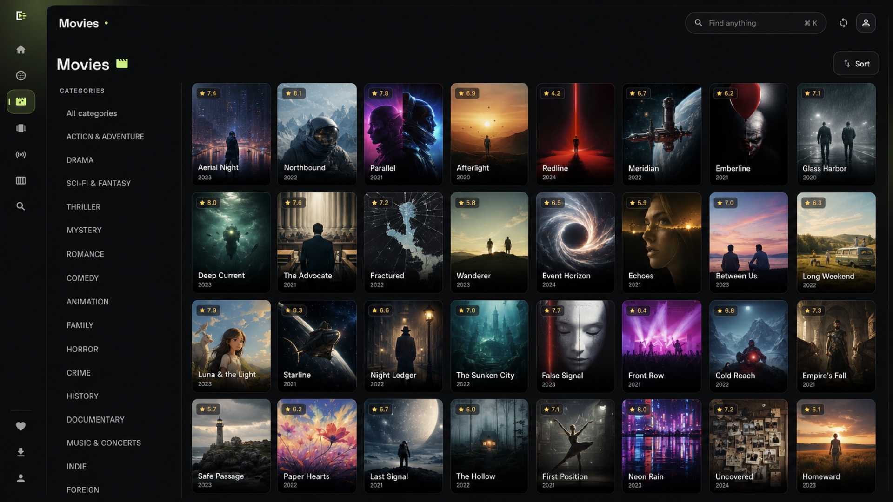
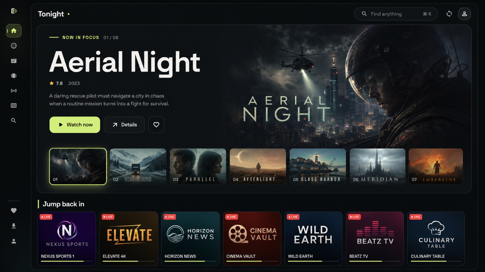
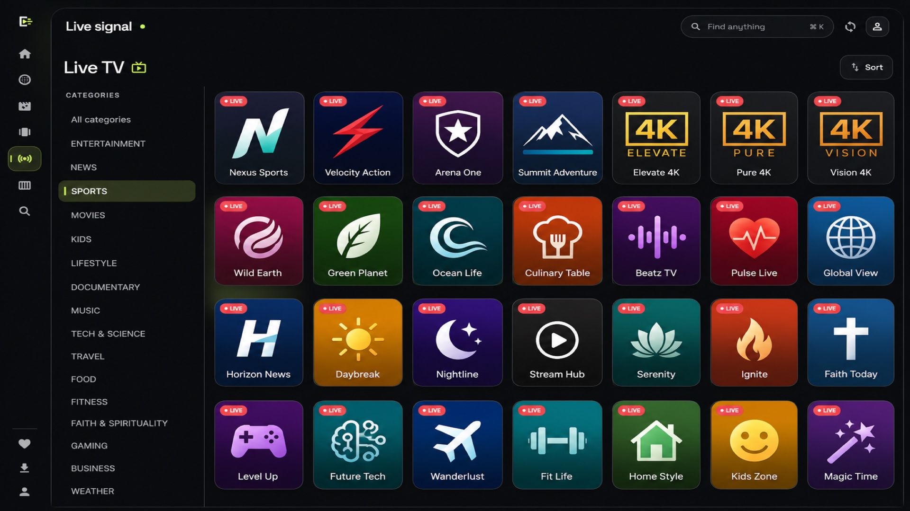
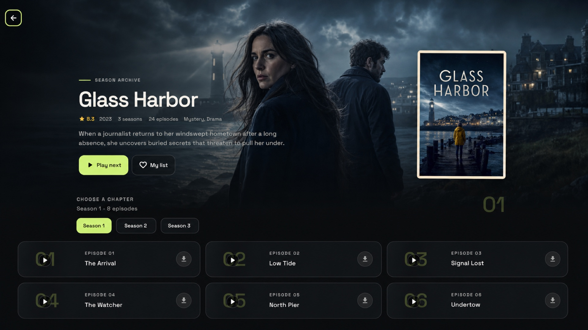
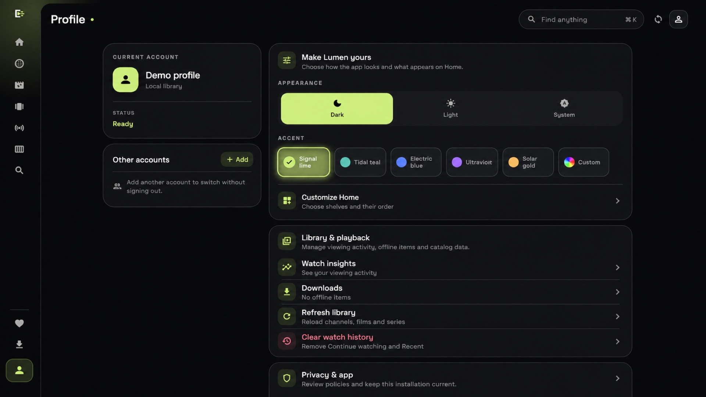

# Lumen

A native, premium **IPTV player** for your own Xtream / X3U subscription — Live TV, Movies and Series with a cinematic UI, on **iOS, Android, Android TV, macOS, Windows and Linux**.

> Bring your own provider. Lumen plays the IPTV service **you already pay for** — it ships with no channels or content of its own.

[](LICENSE)
[](CONTRIBUTING.md)

[](https://github.com/Talha-Ashraf420/Lumen-App/stargazers)

[**Visit the Lumen website**](https://lumen-launch.vercel.app/) · [**View on Google Play**](https://play.google.com/store/apps/details?id=com.talhaashraf.lumen)

---

## ⬇️ Get Lumen

Android and Android TV releases are distributed through Google Play. Lumen is
currently in closed testing; visit the website to request tester access.

[](https://lumen-launch.vercel.app/)
[](https://play.google.com/store/apps/details?id=com.talhaashraf.lumen)

Desktop builds remain available from GitHub Releases:

[](https://github.com/Talha-Ashraf420/Lumen-App/releases/latest/download/Lumen-Windows.zip)
[](https://github.com/Talha-Ashraf420/Lumen-App/releases/latest/download/Lumen-macOS.zip)
[](https://github.com/Talha-Ashraf420/Lumen-App/releases/latest/download/Lumen-Linux-x64.tar.gz)

➡️ Browse all published desktop builds on the **[Releases page](https://github.com/Talha-Ashraf420/Lumen-App/releases/latest)**.

| Platform | File | Install |
|----------|------|---------|
| **Windows** | `Lumen-Windows.zip` | Unzip → run `Lumen.exe` |
| **macOS** | `Lumen-macOS.zip` | Unzip → open `lumen_tv.app` *(right-click → Open the first time)* |
| **Linux** | `Lumen-Linux-x64.tar.gz` | Extract → run the `lumen_tv` binary |

> The download links resolve once the first CI run finishes publishing the **latest** release.

Looking to list Lumen on a store? See **[STORE_LISTING.md](STORE_LISTING.md)**.

---

## 📸 Screenshots

The gallery uses a fictional demo library to showcase Lumen without bundling or
advertising third-party channels, provider credentials, or copyrighted catalogs.

| Movies | Home |
|--------|------|
|  |  |

| Live TV | Series detail |
|---------|---------------|
|  |  |

| Personalization |
|-----------------|
|  |

The complete 1920×1080 Android TV upload set and specifications are available in
**[store_assets/play_store/tv](store_assets/play_store/tv/README.md)**.

---

## ✨ Features

- **Live TV** with fast categories, favorites, and direct channel switching
- **Movies & Series** with TMDB-enriched art, ratings, cast and trailers
- **Immersive home** — full-bleed spotlight hero + scrollable shelves
- **My List**, Continue Watching, Recently watched, and watch stats
- **Fast library search** with content filters, sorting, and multi-profile support
- **Premium player** — A/V track & subtitle controls, subtitle styling & sync,
  speed, sleep timer, picture-in-picture mini-player, hold-for-2×
- **TV remote / D-pad** navigation on Android TV (focus highlights, direct transport)
- **Desktop-native** layout (sidebar, keyboard shortcuts, real fullscreen)

### Player keyboard shortcuts

| Key | Action |
| --- | --- |
| `Space` or `K` | Play / pause |
| `Left` or `J` | Seek backward 10 seconds |
| `Right` or `L` | Seek forward 10 seconds |
| `Up` / `Down` | Volume up / down |
| `M` | Mute / unmute |
| `F` | Toggle fullscreen |
| `S` | Stop and close the player |
| `Escape` | Return to the app |

Arrow keys remain dedicated to focus navigation on Android TV remotes; a
physical keyboard connected to a TV can use `J` and `L` to seek.

## 📺 Android TV

The APK is leanback-enabled and appears on the Android TV / Google TV home row.
Navigate with the remote: **D-pad** moves focus, **center/OK** opens & plays,
**◀ ▶** seek (or change channel on Live), **back** minimizes.

## 🛠️ Tech

Flutter • [media_kit](https://pub.dev/packages/media_kit) (libmpv) for native MKV/TS/HLS playback • Xtream Codes API • TMDB metadata.

## 🤖 Builds

Every push to `main` triggers [GitHub Actions](https://github.com/Talha-Ashraf420/Lumen-App/actions) for quality checks and platform builds. Official Android releases are delivered through Google Play; desktop artifacts are published on GitHub Releases.

Build locally:

```bash
flutter pub get
flutter run                       # current device
flutter build apk --release       # Android
flutter build macos --release     # macOS
flutter build windows --release   # Windows (on Windows)
flutter build linux --release     # Linux
```

## 🤝 Contributing

Contributions are very welcome! Lumen is friendly to newcomers.

- Read **[CONTRIBUTING.md](CONTRIBUTING.md)** for setup, project layout and conventions.
- Pick up a [`good first issue`](https://github.com/Talha-Ashraf420/Lumen-App/labels/good%20first%20issue) or [`help wanted`](https://github.com/Talha-Ashraf420/Lumen-App/labels/help%20wanted).
- Have questions or ideas? Start a [Discussion](https://github.com/Talha-Ashraf420/Lumen-App/discussions).
- New here? The [architecture write-up](docs/blog/building-lumen.md) is a good primer.

### 🗺️ Roadmap / help wanted
- **Cast to TV** (Chromecast / DLNA) — the big open feature
- Localization / translations
- Background downloads on Android
- Windows & Linux polish, accessibility, more keyboard/remote shortcuts

If you're using Lumen, a ⭐ really helps others find it.

## 📄 License

[MIT](LICENSE) © Talha Ashraf. Contributions are welcome, but the Lumen name,
logo and official-release identity are covered by the project’s
[trademark policy](TRADEMARKS.md). Lumen is a player only and includes no
content; you are responsible for the sources you add.
