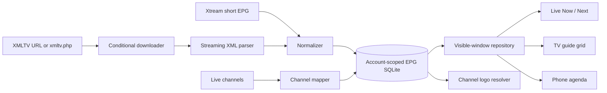

# Lumen EPG research and implementation plan

## Executive decision

Lumen should add EPG as a local-first subsystem with two provider adapters and one shared guide database:

1. **Xtream short EPG** supplies fast “Now / Next” data only for channels currently visible on screen.
2. **XMLTV** supplies the wider guide by downloading a guide file only when the guide is opened or the cached copy is stale, parsing it as a stream, and storing a bounded time window in SQLite.
3. **The UI reads SQLite**, not the network. The full TV guide renders only visible rows and visible time cells, with small overscan buffers.

This is the safest interpretation of “lazy loading.” XMLTV is normally one document containing many channels, so making one XMLTV request per channel is neither possible nor efficient. Network laziness and UI laziness must be handled differently:

- For Xtream, load a small number of visible channels with bounded per-channel calls.
- For XMLTV, perform one conditional download, stream-parse it in the background, and lazily query/render only the visible guide window.
- Never make guide availability a requirement for browsing or playing a channel.

The recommended first release is:

- Now / Next information in the existing Live screen.
- A full TV guide reachable from Live.
- Complete D-pad navigation and focus restoration.
- A phone-friendly agenda view and a tablet/desktop time grid.
- Offline use of the last successful guide.
- No reminders, recording, automatic fuzzy channel matching, or provider-wide EPG polling in version one.

## Implementation status — 12 September 2026

The first usable EPG release described in Milestones 1–4 is implemented:

- Account-scoped SQLite tables, atomic guide generations and overlap-window queries.
- Defensive Xtream short-EPG and incremental XMLTV parsing, including gzip detection, UTC normalization, missing-stop inference and response/programme safety limits.
- Conditional XMLTV refresh with `ETag` and `Last-Modified`; the last successful guide survives a failed replacement.
- A bounded two-request queue that asks Xtream only for the visible live channels and a small overscan window.
- Now/Next metadata and programme progress on Live tiles without delaying channel browsing or playback.
- A virtualized guide with pinned channel/time headers, merged duration cells, a Now line and a fixed detail panel.
- Explicit D-pad navigation by temporal overlap, plus phone agenda and tablet/desktop grid layouts.
- Deterministic ID/name matching and reuse of cached XMLTV channel metadata for missing logos.

The remaining EPG work belongs to the operational milestone: manual channel mapping, a per-account time offset, guide diagnostics/clear-cache controls, and catch-up actions. Moving XML event parsing to a worker isolate and adding a 500-channel performance fixture are also recommended hardening tasks before calling the guide subsystem fully production-tuned; the current parser is memory-bounded and yields at each database batch, but runs on the application isolate.

## What Lumen already has

The current application is a strong base for EPG:

- `LiveStream` already carries `epgId` and `epgName`, populated from Xtream fields or M3U `tvg-id` and `tvg-name` attributes.
- M3U parsing already discovers `url-tvg` and `x-tvg-url` guide locations.
- Xtream accounts already derive the conventional `/xmltv.php` guide URL.
- `CatalogStore` provides an account-scoped SQLite database on Android, iOS, macOS, Windows, and Linux.
- Live catalog screens already page rows, retain stable focus nodes, call `Scrollable.ensureVisible`, debounce TV category changes, and explicitly hand focus back to the navigation rail.
- The project already depends on `linked_scroll_controller`, which can help synchronize a time ruler and guide rows if the first grid implementation uses linked horizontal scroll positions.

There is one important duplication to remove. Channel logo enrichment currently downloads and parses XMLTV independently. The EPG repository should become the single owner of XMLTV retrieval and parsing; logo resolution should consume the channel metadata stored by that repository. Otherwise opening Live and opening Guide can download and parse the same large file twice.

## What established projects do

### XMLTV-based players

Kodi’s IPTV Simple client treats channel sources and guide sources separately. It supports remote or local XMLTV, compressed guides, caching and refresh intervals. It matches guide channels by identifier first and falls back to display names. Kodi also documents that EPG is normally loaded when required rather than for every operation.[^kodi]

OwnTV uses an opt-in guide workflow, gzip-aware streaming ingestion, a bounded future window, and a local Room database. Its implementation is useful evidence that guide parsing belongs off the UI thread and that a local indexed cache is practical on TV hardware.[^owntv] OwnTV is GPL-3.0, so Lumen may learn from the architecture but must not copy its source into a commercial proprietary application.

Jellyfin similarly separates channel tuning information from guide data and requires mapping between the two sources.[^jellyfin] This supports keeping Lumen’s IPTV credentials/catalog and EPG ingestion as separate adapters joined through a channel map.

### Commercial TV-guide interaction patterns

Amazon’s official Vega EPG sample requests guide data in two-dimensional pages: a bounded group of channels crossed with a bounded time range. Its example uses ten channels by twelve hours, merges later pages into the existing grid, and emits a focus event after focus rests for 250 ms.[^amazon-epg] Lumen should use smaller initial time windows for faster first paint, but the two-dimensional page model is the correct abstraction.

Android TV guidance is consistent on the interaction contract: every visible action must be reachable with a D-pad, focus movement must be predictable, a focused action should always be visible, and scrolling content should move as focus reaches its edge.[^android-navigation] Android also treats focus as the primary state on TV and recommends a clear focus indicator, with only one item focused at a time.[^android-focus]

### Xtream EPG behavior

Xtream has no dependable, current official public specification. Open-source clients consistently use these de facto endpoints:

- `player_api.php?action=get_short_epg&stream_id=...&limit=...`
- `player_api.php?action=get_simple_data_table&stream_id=...`
- `xmltv.php?username=...&password=...`

One mature Go implementation defaults short EPG to the next four entries and uses the full data-table action separately.[^xtream-go] Reverse-engineered Xtream documentation shows `epg_listings` containing title, description, channel ID, start/stop timestamps, `now_playing`, and archive information.[^xtream-docs] Because server forks vary, Lumen must parse these fields defensively and fall back to XMLTV or “Guide unavailable” without affecting playback.

## Proposed architecture



### Core components

`EpgSourceAdapter`

- Describes a source and its capabilities.
- Returns short entries for a bounded channel set when the source supports it.
- Exposes a guide stream for full XMLTV ingestion.
- Never exposes credential-bearing URLs to logs or UI.

`XtreamEpgAdapter`

- Calls short EPG only for visible channel IDs.
- Uses a limit of four for Now / Next.
- Decodes plain or Base64-encoded text fields defensively.
- Treats malformed or unsupported responses as a per-channel miss.

`XmltvEpgAdapter`

- Uses M3U `url-tvg` / `x-tvg-url` or the Xtream `xmltv.php` endpoint.
- Sends `If-None-Match` and `If-Modified-Since` when prior validators exist. HTTP defines these conditional requests specifically to avoid retransmitting an unchanged representation; a valid unchanged response is `304 Not Modified`.[^rfc9110]
- Supports server `Content-Encoding: gzip` and `.gz` guide URLs.
- Parses incrementally instead of constructing a complete XML document in memory. XMLTV’s own Perl implementation supports callback-style parsing of channels and programmes, which is the relevant design precedent.[^xmltv-parser]
- Runs parsing and normalization outside the UI isolate.

`EpgRepository`

- Is the only public API used by widgets.
- Reads cached data first and publishes revisions after refresh.
- Deduplicates identical in-flight requests.
- Applies TTL, negative caching, retry backoff, response limits, and account cancellation.
- Returns explicit states: `cached`, `refreshing`, `fresh`, `empty`, `unavailable`, and `failed`.

`EpgWindowController`

- Owns the visible channel range and UTC time interval.
- Queries only programmes overlapping that rectangle.
- Prefetches one small channel/time margin around it.
- Coordinates focus restoration when rows or time cells are recycled.

`EpgFocusCoordinator`

- Owns semantic focus identity independently from widget lifetime.
- Resolves D-pad targets by channel and programme time, not by child creation order.
- Remembers the last focused channel, programme, and time anchor.
- Requests focus only after a lazily created target is mounted.

## Data model and storage

Use the existing account-scoped catalog database and migrate it from schema version 3 to version 4. Keeping EPG in the same database avoids another lifecycle and account-partitioning mechanism, while separate tables preserve responsibility boundaries.

### `epg_programmes`

| Column | Purpose |
|---|---|
| `profile_scope` | Non-secret account partition used by the current catalog |
| `source_key` | Stable hash/fingerprint of source identity, never a credential URL |
| `channel_key` | Normalized XMLTV/Xtream channel identifier |
| `start_utc` | Inclusive start as Unix milliseconds |
| `stop_utc` | Exclusive end as Unix milliseconds |
| `title` | Programme title |
| `subtitle` | Episode or programme subtitle |
| `description` | Optional synopsis |
| `categories_json` | Small JSON array of genres/categories |
| `icon` | Optional programme image |
| `has_archive` | Whether catch-up appears to be supported |
| `catchup_id` | Optional provider archive reference |
| `stop_inferred` | Whether the parser inferred a missing end time |
| `updated_at` | Local ingestion timestamp |

Recommended primary key:

`(profile_scope, source_key, channel_key, start_utc, title)`

Required query index:

`(profile_scope, channel_key, start_utc, stop_utc)`

The window query is based on interval overlap:

`start_utc < requested_end AND stop_utc > requested_start`

### `epg_channels`

Stores channel identifiers, display names, icons and source metadata parsed from XMLTV. Channel logo resolution should use this table instead of redownloading XMLTV.

### `epg_channel_map`

| Column | Purpose |
|---|---|
| `profile_scope` | Account partition |
| `live_stream_id` | Lumen live-channel ID |
| `source_key` | Guide source |
| `epg_channel_key` | Matched guide channel |
| `match_method` | `id`, `epg_name`, `channel_name`, or `manual` |
| `confidence` | Deterministic confidence value |
| `user_override` | Protects a manual mapping from automatic replacement |

### `epg_sources`

Tracks last success, ETag, Last-Modified, cache coverage, failure count, next retry time, parser version, and a sanitized last error. It must not store usernames, passwords, or credential-bearing URLs.

### Retention

- Keep programmes from six hours before now through 48 hours after now by default.
- Preserve a small past window for current programmes and future catch-up work.
- Delete older rows after a successful transaction, not before it.
- Insert in transaction batches of 500–1,000 programmes.
- Retain the last good data if the next fetch or parse fails.

XMLTV declares `start` and `channel` as required, while `stop` is optional. It defines programme intervals as start-inclusive and stop-exclusive and permits explicit time-zone suffixes.[^xmltv-dtd] Lumen should normalize all values to UTC. If `stop` is missing, infer it from the next programme on that channel; if no next programme exists, use a conservative 30-minute fallback and mark it as inferred.

## Channel matching policy

Incorrect guide information is worse than no guide information. Version one should use deterministic matching only:

1. Exact case-insensitive `epgId` / `tvg-id` to guide channel ID.
2. Exact normalized `epgName` / `tvg-name`, only when the result is unique.
3. Exact normalized live channel name, only when the result is unique.
4. Otherwise show “Guide unavailable” for that channel.

Normalization may remove surrounding whitespace, common quality suffixes such as `HD`/`FHD`, and punctuation already handled by Lumen’s logo matcher, but it must not automatically select a fuzzy near-match. Manual mapping can be added in a later settings milestone.

The provider may publish incorrect local times. Store UTC internally, display device-local time, and later expose a per-profile guide offset. XMLTV says a timestamp without a timezone is assumed to be UTC, although real-world provider feeds may violate that rule.[^xmltv-dtd]

## Provider request budget

### Opening Live

1. Render channels immediately from the current catalog cache.
2. Read cached Now / Next from SQLite.
3. After the first frame, request short EPG for the visible 12 channels plus four-channel overscan.
4. Use at most two concurrent EPG calls.
5. Debounce scrolling/focus changes for 250 ms.
6. When one new channel becomes visible, request only that channel if its entry is stale.

The EPG strip may show a compact skeleton while loading. The channel card itself must remain usable and playable.

### Opening Guide

1. Paint the cached guide immediately.
2. If the guide source is fresh, do not call the provider.
3. If stale, begin one conditional XMLTV fetch in the background.
4. If the server returns `304`, update freshness without parsing again.
5. If no usable XMLTV exists, request Xtream guide data only for visible channel rows and the active time window.
6. Merge results into SQLite and publish a new visible-window revision.

### Suggested limits

| Control | Initial value |
|---|---:|
| Visible TV channel window | 12 rows |
| Vertical overscan | 4 rows each side |
| Visible time span | 3 hours |
| Horizontal prefetch | 1 hour each side |
| Short EPG limit | 4 entries/channel |
| EPG request concurrency | 2 |
| Scroll/focus debounce | 250 ms |
| Short EPG freshness | Until current programme ends, max 10 minutes |
| XMLTV freshness | 6 hours, unless provider cache headers are stricter |
| Failed-channel negative cache | 2 minutes |
| Retry backoff | 2, 5, 15, then 30 minutes |
| Compressed response guard | 50 MB |
| Decompressed response guard | 250 MB |
| Programme count guard | 200,000 |

These values should be constants with diagnostics, not invisible magic numbers. A manual Refresh Guide action may bypass normal freshness once, but still respects concurrency and size guards.

## TV user experience

### Live screen

Each live channel tile gains a quiet information area:

- Current title.
- Current programme progress.
- Next title and start time when space allows.
- “Guide unavailable” only after loading completes with no match.

This addition must not change the existing channel tile’s primary Select action: pressing Select still plays the channel.

### Full guide layout

The TV guide should be a mode inside Live rather than a new top-level sidebar section. The top bar contains `Channels` and `Guide` views, plus a `Now` action. This preserves the user’s mental model: EPG is another way to browse live television.

```text
┌────────────────────────────────────────────────────────────────────┐
│ ‹ Live        Guide                         Thu 10 Sep       [Now] │
├──────────────────┬──────────────┬──────────────┬───────────────────┤
│ Channel          │ 20:00        │ 20:30        │ 21:00             │
├──────────────────┼──────────────┴──────────────┼───────────────────┤
│ [logo] Channel 1 │ Current programme          │ Next programme    │
│ [logo] Channel 2 │ Show A     │ Show B         │ Movie             │
│ [logo] Channel 3 │ News                       │ Documentary       │
│                  │             │ NOW            │                   │
└──────────────────┴──────────────┴──────────────┴───────────────────┘
  Focused programme details appear in a reserved panel below the grid.
```

Design rules:

- Sticky channel column on the left.
- Sticky time ruler at the top.
- A visible vertical Now line.
- Programme width reflects duration, with a minimum focusable width.
- A thin, high-contrast focus border aligned to the rectangular tile—no scale transform that collides with neighbouring cells.
- Focused details appear in a reserved panel, never as a popup over the grid.
- Loading cells and unavailable cells look different.
- The current programme uses the selected Lumen accent sparingly; the focus ring remains unambiguous under every accent theme.
- Respect Android TV’s safe margins. Google’s TV layout guidance uses a 960×540 baseline with a 5% safe margin, equivalent to 48 dp horizontally and 27 dp vertically.[^android-layout]

### D-pad contract

Every interaction must work with arrows, Select and Back; no pointer should be required.

| Input | Result |
|---|---|
| Left / Right | Previous or next programme in the same channel |
| Up / Down | Programme in the adjacent channel closest to the current time anchor |
| Left at row start | Focus the channel cell |
| Left from channel cell | Return to the Live navigation rail |
| Right at loaded edge | Extend the time window, then restore focus to the intended target |
| Up from first channel | Move to Guide toolbar |
| Select on currently airing programme | Play that channel |
| Select on future programme | Open programme details; no reminder in v1 |
| Select on past programme with catch-up | Open catch-up action when supported |
| Back | Return to Live and restore the previous channel/time focus |
| Long press Select | Optional future contextual actions; not required in v1 |

For Up/Down, choosing the same column index is incorrect because programmes have unequal durations. The focus coordinator should choose the programme in the next row that overlaps the focused programme’s temporal midpoint; if none overlaps it, choose the nearest programme by start time.

Focus identity should be `(profileScope, channelId, programmeStartUtc)`. Widgets may be destroyed during virtualization, so the semantic focus target must live in the controller. After a scroll mounts the destination, the controller requests its persistent `FocusNode` and calls `Scrollable.ensureVisible`. Flutter documents that `ensureVisible` works through enclosing scrollables, including both axes for a two-dimensional scrollable.[^flutter-ensure-visible]

### Grid implementation choice

Use a custom guide viewport built on Flutter’s two-dimensional scrolling primitives, or a small internal equivalent if sticky channel/time headers require it. Flutter’s `TwoDimensionalChildDelegate` lazily creates only children visible through a two-dimensional viewport.[^flutter-2d] This maps directly to the guide’s channel-by-time rectangle and avoids constructing thousands of programme widgets.

Do not implement the guide as a `Row` containing every programme for every channel. Do not create a horizontal `ListView` controller for every channel. Both approaches produce unnecessary widget/controller counts and make synchronized focus movement fragile.

The first implementation spike should prove three things before visual polish:

1. Sticky channel and time headers remain synchronized.
2. A 500-channel fixture keeps only a small visible set of programme widgets mounted.
3. Focus survives fast repeated D-pad input at every loaded edge.

## Phone, tablet and desktop behavior

### Phone

A dense television grid is difficult to use on a narrow portrait screen. The default phone view should be a channel agenda:

- Channel header with logo and name.
- Now programme with progress.
- The next three to five programmes.
- Day selector and Now action.
- Tap a channel header/current programme to play.

Landscape phone may use the compact time grid.

### Tablet and desktop

Use the full time grid with a narrower channel column and pointer/keyboard support. Arrow keys follow the same semantic focus graph as Android TV. Mouse-wheel vertical scroll and trackpad horizontal scroll should update the same visible-window controller so prefetch behavior stays consistent across platforms.

### Accessibility

Programme semantics should announce channel, title, start/end time, live/future/past state, and catch-up availability. Loading placeholders should not receive focus. Empty guide gaps may receive focus only if they provide a useful explanation; otherwise focus skips them.

## Loading, failure and offline states

EPG is optional metadata. A guide failure must never make Live look empty and must never block playback.

- **Cached + refreshing:** show cached schedule with a subtle refresh indicator in the toolbar.
- **No cached data + loading:** skeleton only inside guide rows, not a full-screen blocking spinner.
- **No match:** “Guide unavailable” for that channel.
- **Provider error:** keep the last good guide and show one non-repeating status message.
- **Offline:** show cached guide coverage and “Last updated …”.
- **Partial source:** render known programmes and mark gaps as unavailable.
- **Account switch:** cancel old source work and discard late results whose profile scope no longer matches.

Only one EPG status surface should be visible at a time. It should use the same deduplication policy as Lumen’s recent network/player status work so users do not receive repeated “connected/restored” popups.

## Security and commercial-readiness requirements

- Never log XMLTV URLs containing usernames/passwords.
- Hash the source identity for database keys and diagnostics.
- Reconstruct authenticated source URLs only from credentials already held by Lumen’s secure account layer.
- Enforce connection, header, idle and total timeouts.
- Limit redirects and reject unsupported schemes.
- Apply compressed size, decompressed size and programme-count guards to prevent resource exhaustion.
- Parse untrusted XML without external entity or network resolution.
- Sanitize guide descriptions before display.
- Ensure all in-flight tasks are account-scoped and cancellable.
- Keep fixtures synthetic; never commit user IPTV credentials or downloaded guides.

## Observability

Add a local Guide diagnostics panel under Profile or Support:

- Source type: Xtream short EPG or XMLTV.
- Last successful refresh.
- Cached date range.
- Number of channels mapped / unmapped.
- Programmes stored.
- Last response status and sanitized error category.
- Download bytes, parse duration and database duration.
- Current backoff state.
- Refresh Guide and Clear Guide Cache actions.

Production analytics, if later added with consent, should use aggregate counts only. It must not transmit channel names, programme titles, provider hosts or account identifiers.

## Test plan

### Parser tests

- Plain XMLTV and gzip XMLTV.
- Explicit UTC offset, positive/negative offsets and DST transitions.
- Missing `stop`, malformed timestamps and overlapping programmes.
- Duplicate channel IDs and programme starts.
- Namespaces, entities, CDATA and very long descriptions.
- Xtream numeric timestamps, textual dates, Base64 fields and missing fields.
- Compression bomb and programme-count guards.

### Repository tests

- Cache-first result followed by refresh revision.
- Request deduplication for the same channel/window.
- Concurrency never exceeds two.
- `304 Not Modified` updates freshness without replacing rows.
- Failed refresh preserves last good data.
- Negative-cache and backoff timing.
- Account switch cancels or ignores old results.
- Correct interval-overlap SQLite query.

### Focus and widget tests

- Every visible control is D-pad reachable.
- Left/right programme movement.
- Up/down chooses temporal overlap, not list index.
- Channel-cell and navigation-rail handoff.
- Toolbar entry and exit.
- Focus restoration after lazy mounting.
- Focus restoration after Back and after Guide/List toggle.
- Loading placeholders never steal focus.
- Repeated edge input does not lose focus or skip unpredictably.
- Golden tests at 960×540 TV, common Android tablet size, portrait phone and desktop.

### Performance and integration tests

- Synthetic 500-channel / 48-hour guide.
- Verify mounted widgets stay proportional to the viewport, not the full dataset.
- Measure first cached paint and first fresh Now / Next paint separately.
- Slow provider, timeout, partial response and offline restart.
- Emulator test driven entirely by D-pad.
- Real-account smoke test without persisting credentials or captured data.

Suggested acceptance targets:

- Cached Now / Next visible within 300 ms on a representative Android TV device.
- Guide opens from cache within 500 ms.
- D-pad focus response under 100 ms when the target is already loaded.
- No more than two EPG HTTP requests in flight.
- No full XMLTV redownload when the server validates the cached copy as unchanged.
- Live browsing and playback remain functional when every EPG request fails.

## Delivery milestones

### Milestone 1 — Data foundation

- Add normalized EPG models.
- Add SQLite schema migration and indexed window queries.
- Add Xtream short EPG parsing.
- Add streaming, gzip-aware XMLTV ingestion with guards.
- Move XMLTV logo extraction behind the new repository.
- Add parser and repository tests.

This milestone has no new guide UI and is the safest next implementation step.

### Milestone 2 — Now / Next in Live

- Add visible-channel window tracking.
- Load cached Now / Next immediately.
- Add concurrency, debounce, TTL and negative cache.
- Render programme title/progress without blocking channel playback.
- Test TV scrolling and existing focus behavior.

### Milestone 3 — TV guide

- Implement the two-dimensional virtualized grid.
- Add sticky headers, Now line and detail panel.
- Implement the explicit focus graph and restoration.
- Add D-pad-only emulator integration tests.

### Milestone 4 — Adaptive guide

- Phone agenda view.
- Tablet and desktop grid sizing.
- Keyboard, pointer and accessibility semantics.

### Milestone 5 — Operational controls

- Manual guide URL and profile time offset.
- Manual channel mapping.
- Guide diagnostics, refresh and clear-cache controls.
- Catch-up integration where provider data is reliable.

## Product decisions and recommended defaults

No question needs to block Milestone 1. The following defaults are recommended unless product direction changes:

| Decision | Recommended default |
|---|---|
| Guide placement | `Channels / Guide` toggle inside Live |
| Initial future horizon | 48 hours |
| Past retention | 6 hours |
| Future programme action | Details only; reminders later |
| Phone presentation | Agenda list by default |
| Automatic matching | Exact and unambiguous only |
| Manual guide URL | Milestone 5 |
| Guide time offset | Milestone 5, per account |
| Catch-up | Display only when confidently supported; full UX later |

The main product question for later is whether a future programme should support reminders. It does not affect the data foundation and should not delay implementation.

## Sources

[^android-navigation]: Android Developers, [TV navigation](https://developer.android.com/training/tv/get-started/navigation).
[^android-focus]: Android Developers, [Focus system for TV](https://developer.android.com/design/ui/tv/guides/styles/focus-system).
[^android-layout]: Android Developers, [Layouts for TV](https://developer.android.com/design/ui/tv/guides/styles/layouts).
[^flutter-ensure-visible]: Flutter API, [Scrollable.ensureVisible](https://api.flutter.dev/flutter/widgets/Scrollable/ensureVisible.html).
[^flutter-2d]: Flutter API, [TwoDimensionalChildDelegate](https://api.flutter.dev/flutter/widgets/TwoDimensionalChildDelegate-class.html).
[^amazon-epg]: Amazon AppDev, [Vega EPG sample](https://github.com/AmazonAppDev/vega-epg-sample).
[^xmltv-dtd]: XMLTV, [XMLTV document type definition](https://github.com/XMLTV/xmltv/blob/master/xmltv.dtd).
[^xmltv-parser]: XMLTV, [Callback-oriented XMLTV parser implementation](https://github.com/XMLTV/xmltv/blob/master/lib/XMLTV.pm.in).
[^kodi]: Kodi PVR, [IPTV Simple Client](https://github.com/kodi-pvr/pvr.iptvsimple).
[^owntv]: OwnTV, [Android TV IPTV player repository](https://github.com/ahXN00/OwnTV).
[^jellyfin]: Jellyfin, [Live TV documentation source](https://github.com/jellyfin/jellyfin.org/blob/master/docs/general/server/live-tv/index.md).
[^xtream-go]: tellytv, [Go Xtream Codes client EPG implementation](https://github.com/tellytv/go.xtream-codes/blob/master/xtream-codes.go).
[^xtream-docs]: World of IPTV, [Reverse-engineered Xtream Codes API documentation](https://github.com/worldofiptvcom/xtream-codes-api-documentation/blob/master/XTREAM_CODES_API_DOCUMENTATION.md).
[^rfc9110]: IETF, [RFC 9110: HTTP Semantics, conditional requests](https://www.rfc-editor.org/rfc/rfc9110.html#name-conditional-requests).
